**Advanced Lane Finding Project**

Jay Urbain

The goals / steps of this project are the following:

* Compute the camera calibration matrix and distortion coefficients given a set of chessboard images.
* Apply a distortion correction to raw images.
* Use color transforms, gradients, etc., to create a thresholded binary image.
* Apply a perspective transform to rectify binary image ("birds-eye view").
* Detect lane pixels and fit to find the lane boundary.
* Determine the curvature of the lane and vehicle position with respect to center.
* Warp the detected lane boundaries back onto the original image.
* Output visual display of the lane boundaries and numerical estimation of lane curvature and vehicle position.

#### [Rubric](https://review.udacity.com/#!/rubrics/571/view) Points

Note: All code for this exercise is located in [notebook](Advance%20Lane%20Lines.ipynb) in the order of the rubrics listed above.

### Camera Calibration

#### 1. Briefly state how you computed the camera matrix and distortion coefficients. Provide an example of a distortion corrected calibration image.

*Code reference: "Compute the camera calibration matrix and distortion coefficients given a set of chessboard images" heading in notebook.*

Image distortion occurs when a camera looks at 3D objects in the real world and transforms them into a 2D image; this transformation isn’t perfect. Distortion actually changes what the shape and size of these 3D objects appear to be. So the first step in analyzing camera images is to undo this distortion by calibrating the camera images so that you can get correct and useful information out of them.

Camera calibration is performed using the following chessboard calibration images:

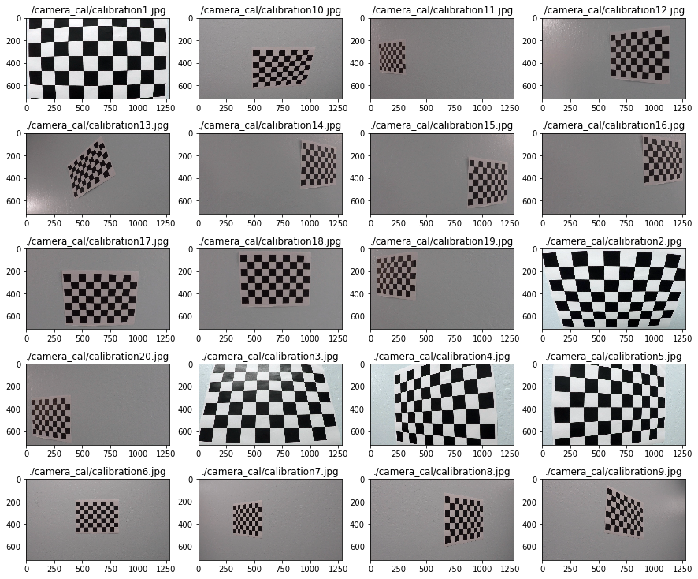

Given a chessboard calibration image and the known pattern size of inside corners, the OpenCV method **cv2.findChessboardCorners** is used to locate the coordinates of the inside chessboard corners. 

Given 2D calibration image points **imgpoints** and 3D world points **objp**, **cv2.calibrateCamera** is used to perform camera calibration. World object points are (x, y, z) coordinates on the chessboard are manually selected. We assume the chessboard is fixed on the (x, y) plane at z=0, such that the object points are the same for each calibration image.  Therefore, **objp** is just a replicated array of coordinates.  **imgpoints** are appended with the (x, y) pixel position of each of the corners in the image plane with each successful chessboard detection.  **cv2.calibrateCamera** returns calibration and distortion coefficients.

**cv2.drawChessboardCorners** is used to draw the mapping from the original calibration image to the undistored (calibrated) images as shown below.

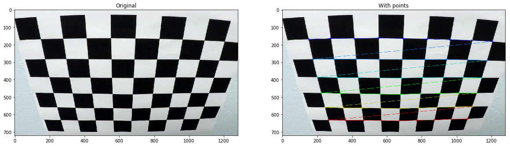

### Pipeline (single images)

#### 1. Provide an example of a distortion-corrected image.

*Code reference: "Apply a distortion correction to raw image" heading in notebook.*

Given an image, and the calibration and distortion coefficients, 
**cv2.undistort** is used to apply a distortion correction to raw images.

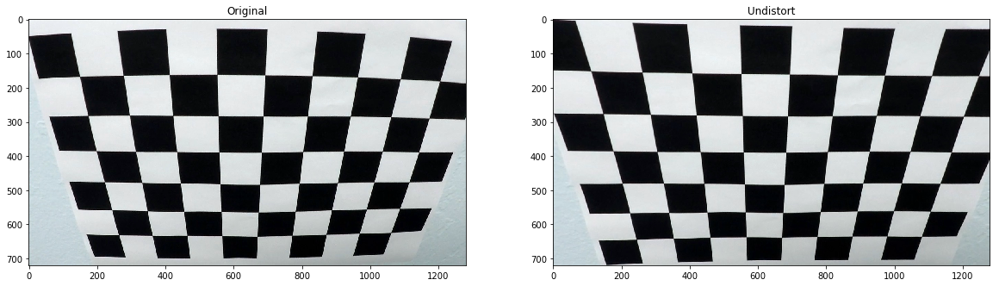

#### 2. Describe how (and identify where in your code) you used color transforms, gradients or other methods to create a thresholded binary image.  Provide an example of a binary image result.

*Code reference: "Use color transforms, gradients, etc., to create a thresholded binary image" heading in notebook.*

A significant effort was expended evaluating gradient and color channels for lane detection.

** Sobel gradient filter **  

X sobel gradient filter (filter=5, min_threshold=50, max_threshold=255):

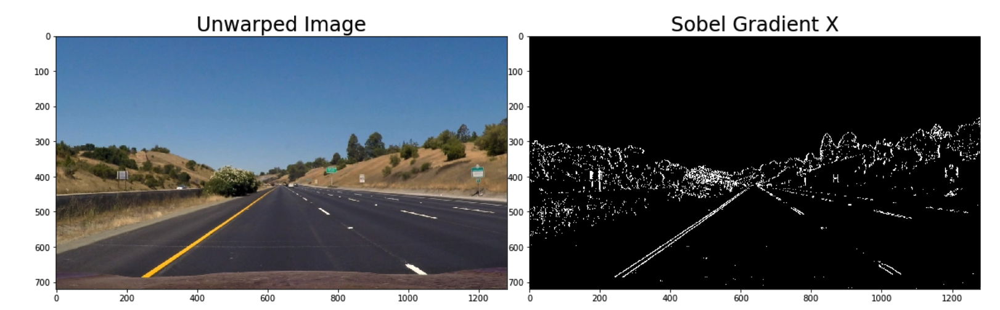

Combined x, y sobel gradient filter (filter=5, min_threshold=50, max_threshold=255):

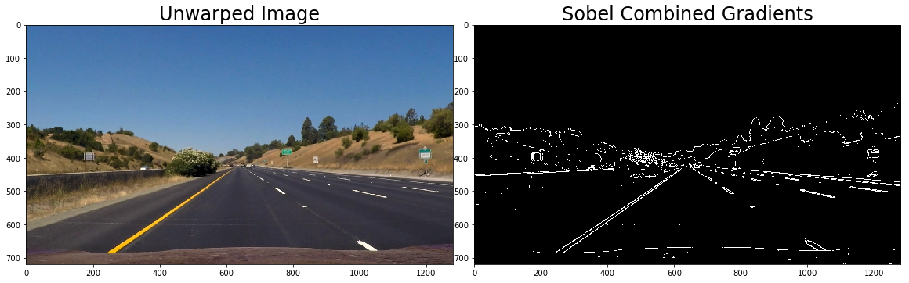

*Note on Sobel gradient filter: The size of the filter had very little impact.*

**Visualization of color space for sample image:**

**cv2.cvtColor()** is used to convert and undistored **RGB** images to an **HSV**, or **HLS** image if needed.

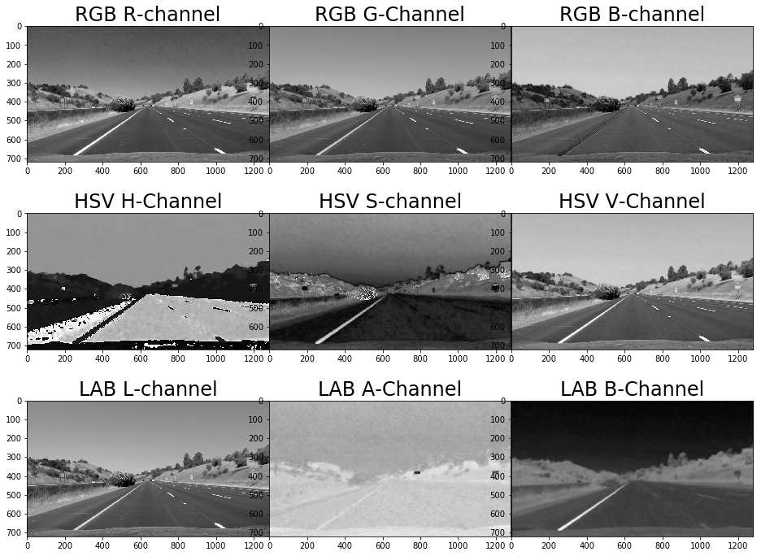

LAB L-Channel for (190,255) worked well:   
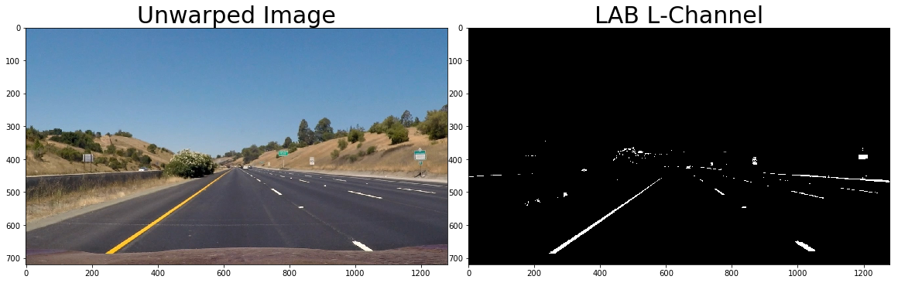

HSV V-Channel for (190,255) worked well, but added noise:  

RGB R-Channel for (190,255):  

 
RGB G-Channel for (190,255):  
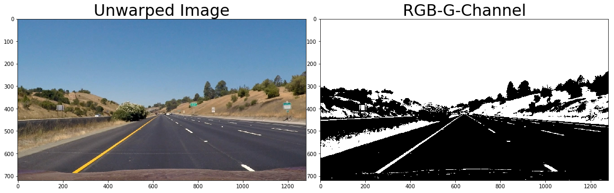

HLS S-Channel for (190,255): did not work as well as expected:

An ablation study was performed across all color channels for all test images. By observation, **L and V** channels appeared to have the best overall performance and were selected for the image processing pipeline. 

#### 3. Describe how (and identify where in your code) you performed a perspective transform and provide an example of a transformed image.

*Code reference: Apply a perspective transform to rectify binary image" heading in notebook.*

Four points where selected from the source image for the perspective transformation. Those points are highlighted on the following image.

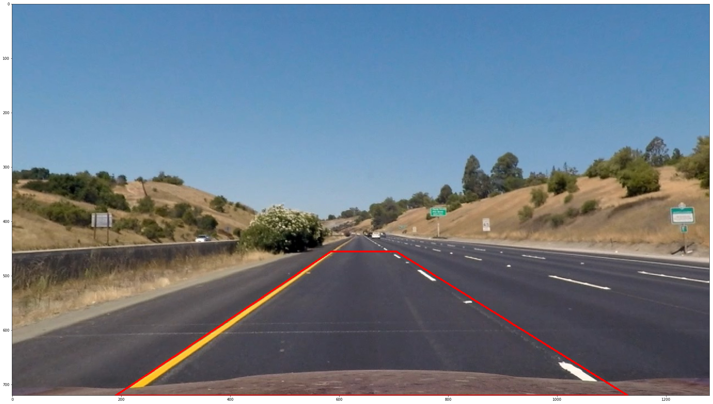

Source and destination points for the transformation:

|Source|Destination|
|-----:|----------:|
|(585, 455)|(200,0)|
|(705, 455)|(max(x) - 200, 0)|
|(1130, 720)|(max(x) - 200, max(y)|
|(190, 720)|(200, max(y)|

Using **cv2.getPerspectiveTransform**, a transformation matrix was calculated, and an inverse transformation matrix was also calculated to map the points back to the original space. 

The perspective transform was verified by drawing the **src** and **dst** points onto a test image and its warped counterpart to verify that the lines appear parallel in the warped image. The result of the transformation on a test image is shown below. Original (left) and perspective transformed (right):

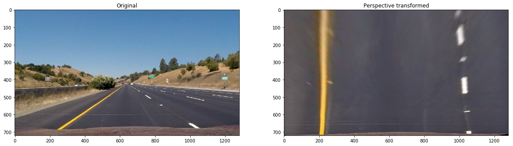

The perspective transform is applied to test images (left) and corresponding warped image (right).

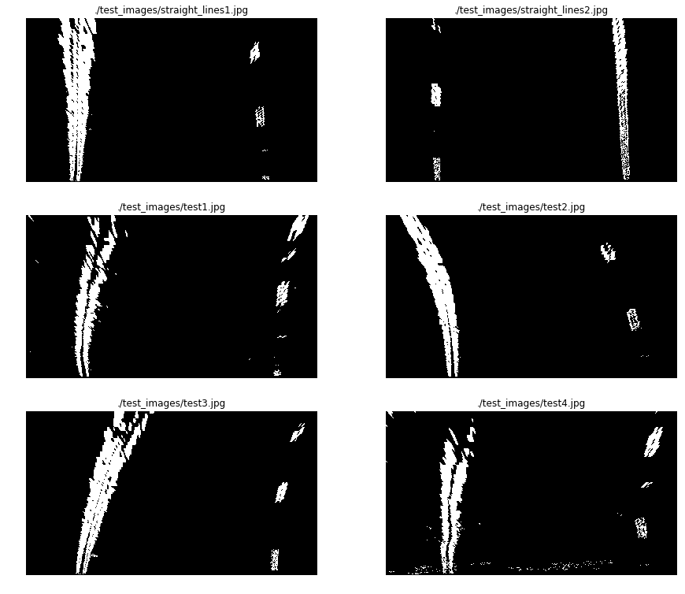

** Image processing pipeline **

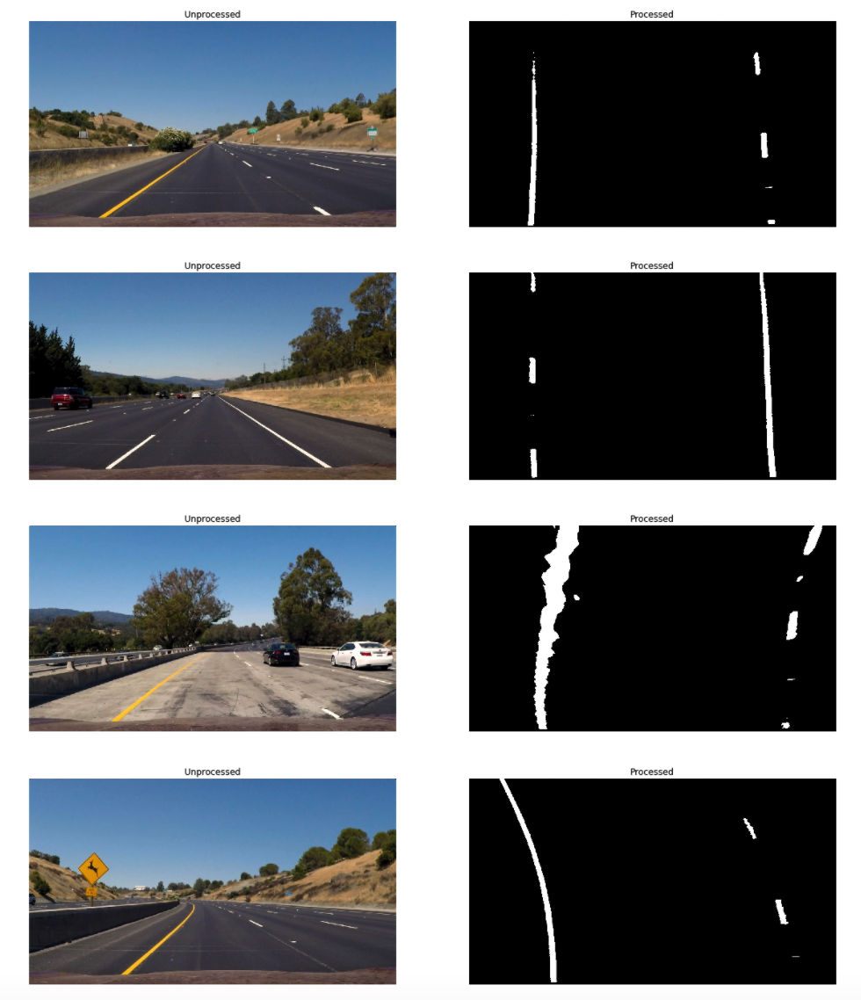

#### 4. Describe how (and identify where in your code) you identified lane-line pixels and fit their positions with a polynomial?

*Code reference: "Detect lane pixels and fit to find the lane boundary" heading in notebook.*

The algorithm calculates the histogram on the X axis. Example:  

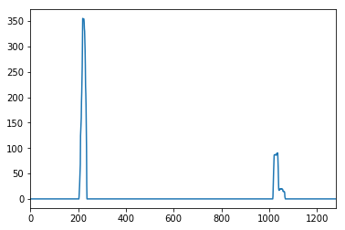

Finds the peaks on the right and left side of the image, and collects the non-zero points within those windows. A polynomial fit is used (**np.polyfit**) to find the line model. Another polynomial fit is used to transform pixels to meters for curvature calculation. The following images shows the points found on each window:

#### 5. Describe how (and identify where in your code) you calculated the radius of curvature of the lane and the position of the vehicle with respect to center.

*Code reference: "Warp the detected lane boundaries back onto the original image" heading in notebook.*

**((1 + (2*fit[0]*yRange*ym_per_pix + fit[1])**2)**1.5) / np.absolute(2*fit[0])**

Where **fit** is the the array containing the polynomial, $yRange$ is the max $Y$ value and $ym_per_pix$ is the meter per pixel value.

The vehicle center position is calculated by: 
- Evaluating the left and right polynomials at the max Y and  middle point. 
- Calculating the vehicle center by transforming the center of the image from pixels to meters.  
- The sign between the distance between the lane center and the vehicle center determines if the vehicle is on to the left or the right.

#### 6. Provide an example image of your result plotted back down onto the road such that the lane area is identified clearly.

*Code reference: "Output visual display of the lane boundaries and numerical estimation of lane curvature and vehicle position" heading in notebook.*

The polynomials where evaluated in a lineal space using the Y coordinates. The generated points where mapped back to the image space using the inverse transformation matrix generated by the perspective transformation. 

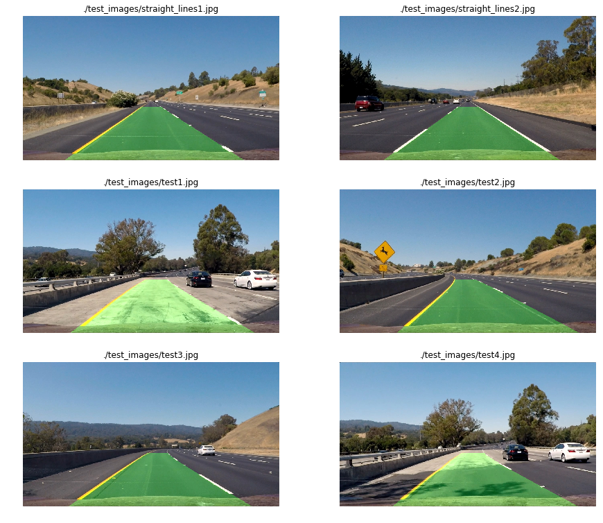

---

### Pipeline (video)

#### 1. Provide a link to your final video output.  Your pipeline should perform reasonably well on the entire project video (wobbly lines are ok but no catastrophic failures that would cause the car to drive off the road!).

Here's a [link to my video result](video_output/project_video.mp4)

---

### Discussion

#### 1. Briefly discuss any problems / issues you faced in your implementation of this project.  Where will your pipeline likely fail?  What could you do to make it more robust?

The biggest problem I had was the amount of time needed to complete this project. The pipeline will most likely fail with low color saturation images. The original submission used the S-channel. A significant effort was then invested in evaluating color channels. Using L- and V- channels defintely helped, but when there is very low light, there just is not much signal to work with. The most difficult situation is going from high light background conditions to almost no light (shade). To correct this several exponential filters were evaluated with modest success. The Jupyter notebook is great for illustrating the image processing pipeline, but a more efficient pipeline could be developed without using a notebook. Other gradients, color channels, and thresholds could be evaluated. 
